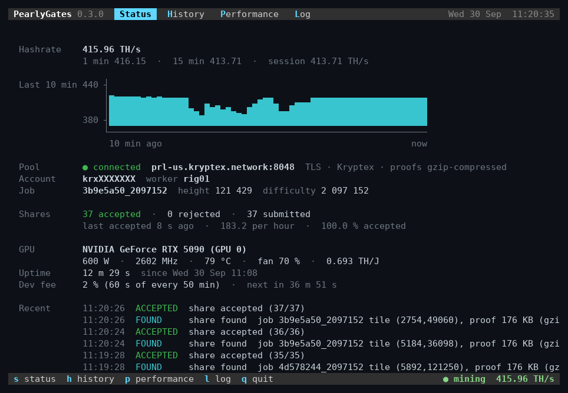

<p align="center"></p>

# PearlyGates

**The fastest Pearl (PRL) miner for the fastest consumer GPU.** Built for the NVIDIA GeForce RTX 5090
from the tensor cores up: **+2.3 % over the fastest other miners** on a hot card, at the same 2 % dev fee.

## Measured performance

| RTX 5090 | PearlyGates | Fastest other miner | |
|---|---:|---:|---:|
| **Cold** (first 2 minutes) | **420.9 TH/s** | 414.1 TH/s | **+1.6 %** |
| **Hot** (after a 10-minute heat soak, 77 °C) | **418.0 TH/s** | 408.6 TH/s | **+2.3 %** |
| Clock when hot | 2617 MHz | 2554 MHz | |
| Dev fee | 2 % | 2 % | |

- Gigabyte AORUS GeForce RTX 5090 at stock settings (600 W power limit, stock clocks)
- Mining on Kryptex (`prl-us`): PearlyGates 0.2.0 against the fastest other miner we know of, on the
  same card on the same day
- The miners took turns, 3 runs each, every run starting from a card cooled to 45 °C
- Hashrates are each miner's own reading (tera multiply-accumulates per second, the unit pools use)
- Our three hot runs: 418.0, 417.9 and 418.1 TH/s
- Other RTX 50-series cards run the same code but are not tuned for yet: run `prlgts bench` to see
  what yours does

## Live display

<p align="center"></p>

In a terminal, PearlyGates shows a live display. Switch tabs with a key:

| Key | Tab | Shows |
|---|---|---|
| `s` | **Status** | hashrate (10 s, 1 min, 15 min, session), pool connection, current job, shares, GPU power, clock, temperature and fan, dev-fee countdown, recent events |
| `h` | **History** | mining events: shares found, accepted and rejected, new jobs, dev fee (`f` filters, arrow keys scroll) |
| `p` | **Performance** | hashrate chart over the last 24 hours, 7 days, 1 month, 3 months or 1 year (`1`–`5`), with shares, average power and efficiency |
| `l` | **Log** | the miner's own messages: start-up, selftest, pool connections, warnings and errors (`f` shows problems only) |
| `space` | | pause / resume |
| `q` | | quit |

The display opens as soon as the miner starts and shows each start-up step (settings, driver, GPU
selftest, pool) until mining begins. The hashrate history is saved next to the miner
(`prlgts-history-<card>.csv`, about 1 MB a year).
With the output redirected to a file, on HiveOS, or with `--no-tui`, the miner prints plain log
lines as before.

**Pause:** `space` frees the GPU completely (its memory and the CUDA context) in about a second, for
a game or other GPU work; `space` again resumes. `./prlgts pause` and `./prlgts resume` do the same
from another shell (for a service or over SSH); a pause lasts until you resume, also over a
restart. Paused time does not count toward the dev fee.

## Installation

#### Servers

Kryptex ([pool.kryptex.com/prl](https://pool.kryptex.com/prl)). TLS on port 8048, plain TCP on 7048:

```ini
stratum+ssl://prl.kryptex.network:8048      # global
stratum+ssl://prl-us.kryptex.network:8048   # North America
stratum+ssl://prl-eu.kryptex.network:8048   # Europe
stratum+ssl://prl-sg.kryptex.network:8048   # Singapore
stratum+ssl://prl-hk.kryptex.network:8048   # Hong Kong
stratum+ssl://prl-br.kryptex.network:8048   # South America
```

Your pool user is your Kryptex username (`krxXXXXXXX`) or your PRL address.

#### Other pools

`--pool` takes any `HOST:PORT`, plain TCP or TLS (`stratum+ssl://`), and `--user` your PRL address
(`prl1...`) with the rig name after a dot or in `--worker`. Pick the pool's stratum format with
`--dialect`:

| `--dialect` | Pools | Status |
|---|---|---|
| `kryptex` (default) | Kryptex | tested |
| `luckypool` | LuckyPool | not yet tested on the live pool |

A pool that speaks neither format fails at login. Kryptex also takes compressed proofs (5 KB
instead of 176 KB), so fewer shares go stale there.

#### Linux (NVIDIA)

```sh
## Download
wget -c https://github.com/prlgts/pearly-gates/releases/download/v0.3.0/pearly-gates-0.3.0-linux-x86_64.tar.gz \
&& tar xzf pearly-gates-0.3.0-linux-x86_64.tar.gz \
&& cd pearly-gates-0.3.0-linux-x86_64

## Check this machine (driver, libraries, GPU selftest) without mining
./prlgts check

## Set your pool user: the user line (and pool / worker if you like)
nano prlgts.conf

## Start
./prlgts
```

`prlgts` reads `prlgts.conf`, checks the driver and the GPU (selftest), then mines, and starts
again by itself after a GPU error. It uses the first GPU; with more than one, run a copy of the
folder per GPU with `device = 1` and so on in its `prlgts.conf`, or use the HiveOS package below,
which does that for you. `q` or `Ctrl+C` stops it. To keep a log (plain lines instead of the live
display): `./prlgts 2>&1 | tee -a miner.log`.

To start it at boot, the package includes a systemd unit, `prlgts.service`, with the steps in its
comments:

```sh
sudo mv pearly-gates-0.3.0-linux-x86_64 /opt/pearly-gates
sudo cp /opt/pearly-gates/prlgts.service /etc/systemd/system/
sudo systemctl daemon-reload && sudo systemctl enable --now prlgts
journalctl -u prlgts -f                 # the miner's output
```

#### HiveOS (NVIDIA)

Create a flight sheet with a **Custom** miner and set its miner config to:

| Field | Value |
|---|---|
| Miner name | `pearlygates` (filled in from the installation URL) |
| Installation URL | `https://github.com/prlgts/pearly-gates/releases/download/v0.3.0/pearlygates-0.3.0.tar.gz` |
| Hash algorithm | `pearlhash` |
| Wallet and worker template | `%WAL%.%WORKER_NAME%` |
| Pool URL | `stratum+ssl://prl-us.kryptex.network:8048` (or a server above) |
| Extra config arguments | optional, e.g. `--gpu-plimit 500` |

Use your Kryptex username (`krxXXXXXXX`) or PRL address as the wallet. The package runs one miner
per GPU (the selftest first, on each card; a card that fails it is left idle) and reports
hashrate, shares, temperatures and fans to the HiveOS dashboard. Or import this flight sheet:

```json
{
    "name": "pearl-pearlygates",
    "items": [
        {
            "coin": "PRL",
            "pool_ssl": true,
            "miner": "custom",
            "miner_alt": "pearlygates",
            "miner_config": {
                "url": "stratum+ssl://prl-us.kryptex.network:8048",
                "miner": "pearlygates",
                "template": "%WAL%.%WORKER_NAME%",
                "algo": "pearlhash",
                "install_url": "https://github.com/prlgts/pearly-gates/releases/download/v0.3.0/pearlygates-0.3.0.tar.gz",
                "user_config": ""
            }
        }
    ]
}
```

Logs on the rig: `/var/log/miner/custom/pearlygates.log` (all GPUs) and
`pearlygates.g0.log`, `pearlygates.g1.log`, ... per GPU.

#### Windows

1. Download and unzip `pearly-gates-0.3.0-windows-x86_64.zip`.
2. Right-click `prlgts.conf` → Edit (or open it in Notepad), then set:
   - `user`: your Kryptex username (`krxXXXXXXX`) or PRL address
   - `worker`: a name for this rig (e.g. `rig01`)
   - `pool`: leave as `stratum+ssl://prl-us.kryptex.network:8048` or pick a server above
3. Double-click `prlgts.exe`.

The miner checks the driver and the GPU (selftest) in its window, then mines, and starts again by
itself after a GPU error. Press `q`, close the window or press `Ctrl+C` to stop.

To start it at every logon, run `prlgts.exe autostart on` in the folder (a Command Prompt or
PowerShell there): it becomes a Startup app that opens minimized, switchable in Settings > Apps >
Startup. `prlgts.exe autostart off` removes it.

#### Manual / advanced run

```sh
./prlgts selftest                                   # must print SELF-TEST PASS
./prlgts mine --pool stratum+ssl://prl-us.kryptex.network:8048 --user krxXXXXXXX --worker rig01
./prlgts bench --seconds 30                         # offline hashrate, power and clocks
./prlgts help                                       # all options
```

On Windows use `prlgts.exe` in the same way.

## Requirements

| | Linux x86-64 | Windows x86-64 |
|---|---|---|
| GPU | NVIDIA GeForce RTX 50-series (Blackwell, compute capability 12.x); tuned for the RTX 5090 | same |
| Driver | NVIDIA 580 or newer, open kernel modules (not nouveau) | NVIDIA 580 or newer (Game Ready or Studio) |
| System | glibc 2.28+: Ubuntu 20.04+, Debian 10+, RHEL / Rocky / Alma 8+, Fedora, Arch, openSUSE Leap 15+ (not musl-based Alpine) | Windows 10 or 11 |
| Anything else | Nothing: the CUDA runtime is built in | Nothing: no Visual C++ redistributable needed |

`./prlgts check` tells you what is missing and how to install it on your distro.

## GPU power and clock settings

`mine`, `bench` and `gpuset` take power and clock settings, applied through the driver and restored
when the miner exits. They need root on Linux (`sudo ./prlgts`) or *Run as administrator*
on Windows; put them in `prlgts.conf` (`gpu-plimit = 500`) or on the command line.

```sh
--gpu-plimit 500      # board power limit, W
--gpu-cclock 2400     # lock the core clock, MHz
--gpu-coffset 150     # core clock offset, MHz (+ = less voltage for the same clock)
--gpu-moffset -1000   # memory clock offset, MHz
./prlgts gpuset --query   # current settings and the allowed ranges
./prlgts gpuset --reset   # back to defaults (after a forced kill)
```

`mine --check 64` re-runs every 64th grid and compares every hash tile, so an unstable undervolt or
overclock shows up as differing tiles instead of silently lost shares.

## Verify your download

Each release lists the SHA-256 of every package (`SHA256SUMS`):

```sh
sha256sum -c SHA256SUMS --ignore-missing
```

## Dev fee

PearlyGates keeps a 2 % dev fee, the same as the fastest other miners: about 1 minute in every 50
is mined for the developer. The miner prints the fee at start and marks each fee period in its
output. On pools other than Kryptex, the fee minute runs on a separate connection to Kryptex, and
your own pool connection stays open.

## License

PearlyGates is distributed as binaries; all rights reserved. It includes the upstream Pearl
consensus code (ISC), Rust crates under their own licenses and the NVIDIA CUDA runtime: see
`LICENSES/` in each release. Provided as is, without warranty of any kind. No telemetry.
